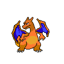
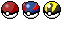

# Pixel Art

> A curated collection of original pixel art, sprites, and environmental assets.

---

## 🖼️ Featured Artwork

---

## 🛠️ Technical Details

* **Software Used:** [e.g., Aseprite / Piskel / Photoshop]
* **Common Resolutions:** 16x16, 32x32, and 64x64.
* **Color Palettes:** [e.g., DB32 / Lospec / Custom Palette].

---

## 📜 Licensing & Usage

**This work is licensed under [e.g., Creative Commons Attribution 4.0 International].**

* **Personal Use:** ✅ You are free to use these for learning or non-commercial projects.
* **Commercial Use:** Yes.

---

## 🚀 Installation & Download

To use these assets in your own project, you can clone this repository.
